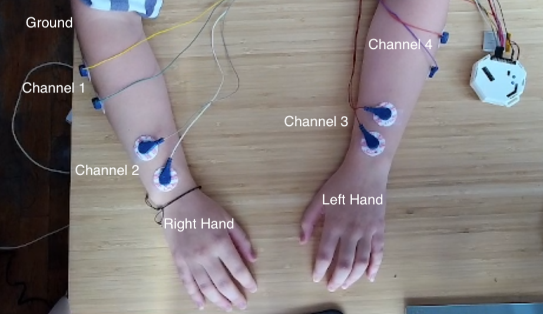
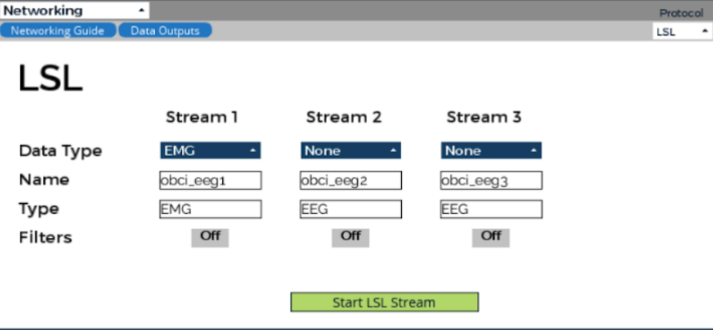

In this tutorial, we will show you how to play the piano using just the EMG signals from your fingers! To do that, we will read EMG data from the muscles joining your fingers to your arms and find the peaks which correspond to pressing a key on a piano, using them as a trigger to play a virtual keyboard.

 Check out an example video of this tutorial being put into action!

 

## Materials Required

1.  OpenBCI [Cyton Board](https://shop.openbci.com/collections/frontpage/products/cyton-biosensing-board-8-channel?variant=38958638542)
2.  [Skintact sticky electrodes](https://shop.openbci.com/collections/frontpage/products/skintact-f301-pediatric-foam-solid-gel-electrodes-30-pack?variant=29467659395) or [IDUN Dryode](https://shop.openbci.com/collections/frontpage/products/idun-dryode-kit)
3.  [EMG/ECG Snap Electrode Cables](https://shop.openbci.com/collections/frontpage/products/emg-ecg-snap-electrode-cables?variant=32372786958)
4.  Computer with downloaded OpenBCI [GUI](Software/OpenBCISoftware/01-OpenBCI_GUI.md)

## Step 1: Hardware Assembly

Follow the EMG Getting Started [tutorial](GettingStarted/Biosensing-Setups/02-EMG-Setup.md) on this link to connect the electrodes to your body and the Cyton board, and read data from it using the OpenBCI GUI. For this tutorial, 4 channels are used: Channel 1 = right pinky, Channel 2 = right pointer, Channel 3 = left pointer, Channel 4 = left pinky. Only one ground is needed.

**Important**: The most complicated part of this tutorial can be finding the right placement for each set of electrodes. The diagram seen below should work well universally, but feel free to mess around with the placement a bit to find where the most prominent flexes occur along your arms.

## Step 2: Software Setup

Download and install [Python](https://www.python.org/downloads/) (either version 2 or 3). Python might already be installed on your computer. Type python --version to check if you have Python version 2 or 3 installed. To use this program, you need the following Python packages installed:

-   **pylsl**: use `python -m pip install pylsl` from the Python folder in the command line to install it.
-   **pyautogui** : use `python -m pip install pyautogui` to install.

## Step 3: Stream data using the OpenBCI GUI

Follow the networking [tutorial](Software/OpenBCISoftware/02_GUI_Widget_Guide.md#Networking) on this link to learn how to stream data using LSL from the GUI. For this project, you will need to stream the EMG data from Channels 1-4 using the Networking Widget. Your Networking settings should look as follows:

 **Important**: Make sure your EMG widget is open before you start streaming.

## Step 4: Using a Python Script to Read the Data and Play

The Python script will search for an EMG data stream. Once it finds the stream it will read it and detect any spikes that correspond to finger flex. If a flex is detected and 1 second has passed since the last flex, it will press a certain key, which will play a certain note on a virtual keyboard. The threshold for the time between flexes can be modified as needed to avoid debouncing.

Get the Python script from [here](https://github.com/OpenBCI/OpenBCI_Tutorials/tree/master/EMG_Controlled_Piano) by clicking on ‘Raw’ and copying it to a .py file in your Python folder. Once you’re streaming data from the GUI, go to the Python folder from your command line by using the cd command, and run it using `python <script_name>.py`

Open a virtual keyboard; we used [this one](https://www.onlinepianist.com/virtual-piano). Every time you move one of your fingers, it will play certain notes. By modifying the time_thres, pointer_thres, and pinky_thres parameters in the code, you can adjust the time to wait between finger movements and the strength of each movement to your needs. 

**Note:** The pointer finger flex can be slightly weaker, so the script establishes separate thresholds for the pointer fingers and the pinkies.

The script codes for 4 different notes to play, each designated to one finger: G4 = right pinky, E4 = right pointer, D4 = left pointer, C4 = left pinky. To play Mary Had a Little Lamb, use the following guide in terms of Channels: 

2 , 3 , 4 , 3 , 2 , 2 , 2 , 3 , 3 , 3 , 2 , 1 , 1 , 2 , 3 , 4 , 3 , 2 , 2 , 2 , 2 , 3 , 3 , 2 , 3 , 4 

Try it out and send us a video of your final prototype!
